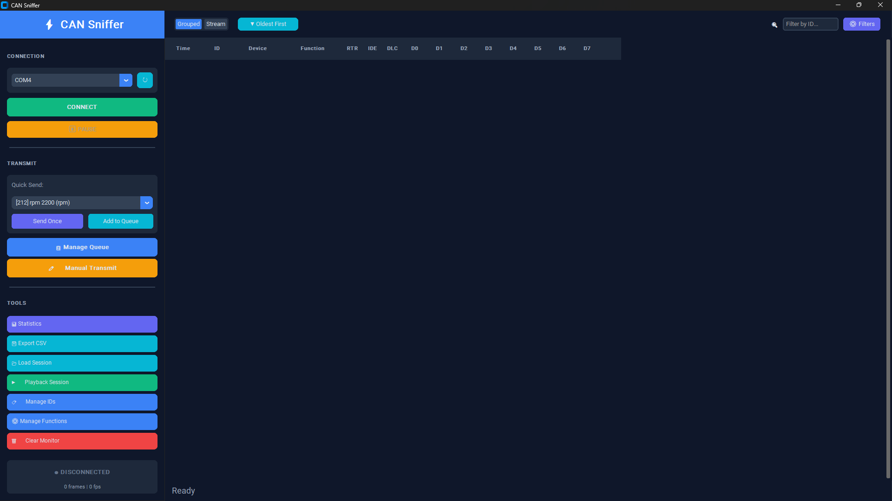
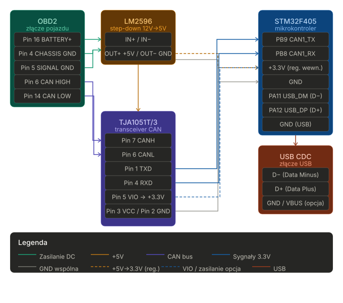

# Dokumentacja projektu — OBD-Telemetry

## Cel
- Krótkie narzędzie telemetryczne dla pojazdu OBD: sniffowanie ramek CAN, dekodowanie parametrów (RPM, prędkości kół, TPS, temperatury, boost itp.) i wysyłka w formacie JSON przez USB CDC oraz opcjonalne wysyłanie poleceń trybu jazdy.

## Kluczowe pliki
- `firmware/Core/Src/can_handler.c` — konfiguracja filtrów CAN, ISR RX, dekoder ramek, (szablon) funkcja nadawcza trybu jazdy.
- `firmware/Core/Inc/can_handler.h` — definicje struktur danych: `CAN_RawFrame`, `TelemetryFrame`, enum `DriveCmd` i deklaracje kolejek.
- `firmware/Core/Src/usb_handler.c` — serializacja `TelemetryFrame` do JSON i funkcja parsująca komendy przychodzące przez CDC.
- `firmware/Core/Inc/usb_handler.h` — prototypy `usb_send_telemetry()` i `usb_parse_cmd()`.
- `firmware/Core/Src/freertos.c` — tworzenie kolejek FreeRTOS oraz implementacja zadań: `Task_CAN_Decode`, `Task_USB_TX`, `Task_Drive_TX`.
- `firmware/Core/Src/main.c` — inicjalizacja peryferiów (CAN1/CAN2, GPIO, USB), start RTOS i `defaultTask` (uruchamia USB device).
- `firmware/obd-telemetry.ioc` — konfiguracja CubeMX (można otworzyć w STM32CubeIDE aby wygenerować/zmodyfikować projekt).
- `firmware/EWARM/` — projekt Keil MDK-ARM (pliki projektu do budowy dla Keil).

## Architektura runtime
- ISR CAN (HAL callback `HAL_CAN_RxFifo0MsgPendingCallback`) odczytuje ramkę i wrzuca `CAN_RawFrame` do kolejki `q_raw_frames`.
- `Task_CAN_Decode` pobiera surowe ramki, wywołuje dekoder (`can_decode_and_update`) i publikuje aktualny `TelemetryFrame` do `q_telemetry` (zastępując poprzedni wpis).
- `Task_USB_TX` odczytuje `q_telemetry` i co ~20 ms wysyła JSON przez USB CDC (`usb_send_telemetry`).
- `Task_Drive_TX` czeka na komendy w `q_tx_cmd` i przekazuje je do funkcji nadawczej CAN (`can_send_drive_mode`) — obecnie jest to szablon/zakomentowane (wymaga uzupełnienia ID i payload).

## Struktury i kolejki
- `CAN_RawFrame` (w `can_handler.h`): { `id`, `dlc`, `data[8]`, `timestamp` } — surowa ramka odbierana z ISR.
- `TelemetryFrame`: zawiera pola: `rpm`, `speed` (km/h*10), `temp_engine`, `temp_oil`, `boost_kpa`, `throttle`, `tv_rear_left/right`, `drive_mode`, `wheel_spd[4]`, `timestamp`.
- Kolejki (wg `freertos.c`): `q_raw_frames` (32 elementy), `q_telemetry` (8 elementów), `q_tx_cmd` (4 elementy).

## Dekodowanie CAN (co robi kod)
- Filtry: `can_filter_init_all()` ustawia CAN1 w trybie "sniff" (przepuszcza wszystkie ramki), CAN2 jako slave (banki filtrów zależne od układu F405).
- ISR `HAL_CAN_RxFifo0MsgPendingCallback`: pobiera nagłówek i bajty ramki, buduje `CAN_RawFrame` i wrzuca do `q_raw_frames` (wersja FromISR).
- `decode_frame()` rozpoznaje kilka stałych ID i ekstraktuje wartości:
  - `CAN_ID_WHEEL_SPEED` (0x190): bajty 0-1 FL, 2-3 FR, 4-5 RL, 6-7 RR; zapisane jako 16-bit, `speed` = średnia czterech kół.
  - `CAN_ID_THROTTLE` (0x213): throttle = data[0] * 100/255.
  - `CAN_ID_TEMP` (0x420): `temp_engine` = data[0] - 40.
  - OBD-II response `0x7E8`: obsługa service 0x41 (response dla service 01) — parsuje PIDy: 0x0C (RPM), 0x0D (vehicle speed), 0x0B (boost/MAP), 0x5C (oil temp).
- Nieznane ID są ignorowane przez dekoder (zapisywane jako raw do sniffingu — można wysyłać je przez USB w celu analizy).

## USB / protokół szeregowy
- `usb_send_telemetry()` serializuje `TelemetryFrame` do pojedynczego JSON-owego obiektu zakończonego CRLF. Przykład pól:
  - `ts` (timestamp), `rpm`, `spd` (km/h), `boost`, `tps`, `t_eng`, `t_oil`, `tv_rl`, `tv_rr`, `spd_fl`, `spd_fr`, `spd_rl`, `spd_rr`, `mode`.
- `usb_parse_cmd()` parsuje komendy tekstowe w formacie `CMD:NAME`, obsługiwane predefiniowane: `CMD:NORMAL`, `CMD:SPORT`, `CMD:TRACK`, `CMD:DRIFT`, `CMD:SNOW`. Zwraca enum `DriveCmd` lub `CMD_NONE`.

## Napotkane problemy i ich rozwiązania
- Głównym problemem był brak dostępności dokumentacji zawierającej ID ramek CAN. Pula ramek, która jest standaryzowana pomiędzy wszystkimi producentami samochodów jest niewielka i zawiera głównie informacje potrzebne do funkcjonowanie systemów ADAS (Advanced Driver Assistance Systems), systemów bezpieczeństwa oraz uniwersalnej diagnostyki za pomocą OBDII.
- Aby sniffer mógł odczytać ramki z systemu Torque Vectoring'u, najpierw trzeba było wymusić jego aktywność. W tym celu należy w dynamiczny sposób prowadzić na krętej drodze. Ze względu na obowiązujące przepisy ruchu drogowego, udaliśmy się na zamknięty obiekt, gdzie można było wymusić działanie systemu. Pomimo wszelkich starań okno działania jest względnie niewielkie, co znacznie utrudniło dostosowanie filtrów oraz zmniejszyło ilość dostępnych danych.
- Kolejny problem stanowiło zbudowanie warstwy hardware'owej. Ze względu na konieczność samodzielnego lutowania pinów do podzespołów część czasu musiała zostać poświęcona na testowanie poprawności fizycznego funckcjonowania systemu.

## Zewnętrzny program
Do wizualizacji i przejrzystej analizy odbieranych ramek CAN z magistrali, wykorzystaliśmy dedykowaną aplikację komputerową, którą stworzyłem w ramach mojej pracy inżynierskiej. Program ten w znacznym stopniu usprawnił pracę nad projektem, pozwalając na intuicyjne monitorowanie transmitowanych danych w czasie rzeczywistym i wychwytywanie wzorców dla konkretnych ID.

## Schemat połączeń i Pinout

### 1. Przetwornica Step-Down (LM2596) — Sekcja Zasilania

Przetwornica obniża napięcie z instalacji samochodowej (zazwyczaj 12V–14.4V) do stabilnego napięcia 5V, które zasila transceiver CAN oraz stabilizator 3.3V mikrokontrolera.

* **Wejście zasilania (IN):**
* `OBD2 Pin 16 (BATTERY +)` -> `LM2596 IN+`
* `OBD2 Pin 4 (CHASSIS GND)` -> `LM2596 IN-`
* `OBD2 Pin 5 (SIGNAL GND)` -> `LM2596 IN-`

* **Wyjście zasilania (OUT):**
* `LM2596 OUT+ (+5V)` -> `TJA1051 VCC (Pin 3)` oraz wejście stabilizatora 3.3V dla STM32
* `LM2596 OUT- (GND)` -> Wspólna masa układu (GND)

### 2. Transceiver CAN (TJA1051T/3)

Wersja `/3` tego układu posiada dedykowany pin `VIO`, który służy do dopasowania poziomów logicznych do standardu 3.3V. Pozwala to na bezpieczną, bezpośrednią współpracę z procesorami STM32 bez użycia dodatkowych konwerterów napięć.

* **Strona magistrali (Samochód):**
* `TJA1051 Pin 7 (CANH)` -> `OBD2 Pin 6 (CAN HIGH)`
* `TJA1051 Pin 6 (CANL)` -> `OBD2 Pin 14 (CAN LOW)`

* **Strona logiczna (Mikrokontroler STM32F405):**
* `TJA1051 Pin 1 (TXD)` -> `STM32 PB9 (CAN1_TX)`
* `TJA1051 Pin 4 (RXD)` -> `STM32 PB8 (CAN1_RX)`
* `TJA1051 Pin 5 (VIO)` -> `STM32 +3.3V`
* `TJA1051 Pin 3 (VCC)` -> `LM2596 OUT+ (+5V)`
* `TJA1051 Pin 2 (GND)` -> Wspólna masa (GND)

### 3. Interfejs USB CDC (STM32F405)

Urządzenie wykorzystuje wbudowane peryferium USB_OTG_FS w trybie Device do komunikacji z komputerem.

* `STM32 PA11 (USB_DM)` -> Złącze USB Data- (D-)
* `STM32 PA12 (USB_DP)` -> Złącze USB Data+ (D+)
* `Wspólna masa (GND)` -> Złącze USB GND
* *(Opcjonalnie)* `Złącze USB VBUS (+5V)` można podpiąć przez diodę zabezpieczającą do sekcji zasilania, aby umożliwić diagnostykę i działanie układu "na biurku" po podpięciu do komputera, bez konieczności zasilania z portu OBD2.

---

### Schemat połączenia

## Działanie
- Ramki, które były użyteczne do projektu, musiały zostać odkryte oraz rozpracowane za pomocą sniffingu. Udało się określić następujące ID dla samochodu Ford Focus MK3 RS:
  - ID: 0x070 => obliczony moment obrotowy przekazywany do skrzynii biegów,
  - ID: 0x080 => Throttle Position Sensor, połozenie pedału przepustnicy, 9000=0%, 98e3=>100%, skala liniowa
  - ID: 0x090 => RPM, obroty silnika na minutę,
  - ID: 0x420 => Tryby jazdy, działanie sprzężenia aktywnego napędu na 4 koła firmy GKN
  - ID: 0x190 => Prędkości obrotowe poszczególnych kół,
  - ID: 0x1B0 => Maksymalny moment obrotowy przekazywany do systemu Torque Vectoringu, aby odczytać wartość w NM należy od wartości przekazywanej w ramce odjąć 1250,
  - ID: 0x2C0 => Moment obrotowy przekazywany do kół z prawej strony, wartość przekazywana w ramce jest bezpośrednią wartością momentu obrotowego
  - ID: 0x2D0 => Moment obrotowy przekazywany do kół z lewej strony, wartość przekazywana w ramce jest bezpośrednią wartością momentu obrotowego
Nie są to wszystkie ramki odkryte podczas sniffingu, są jednak najbardziej istotne dla działania projektu.
---
